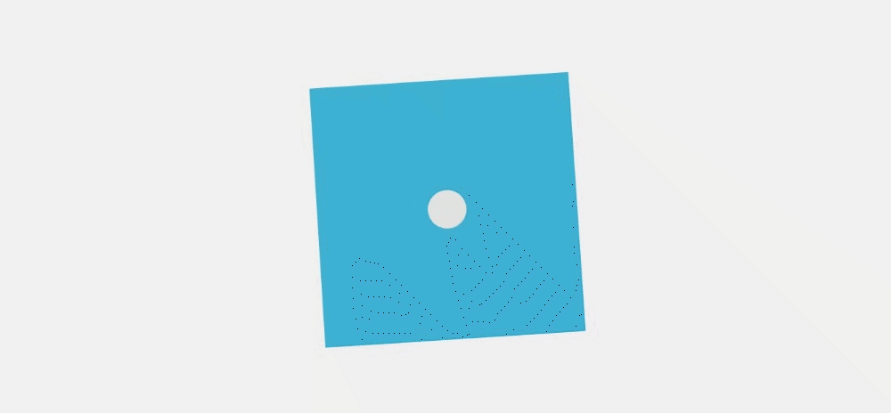
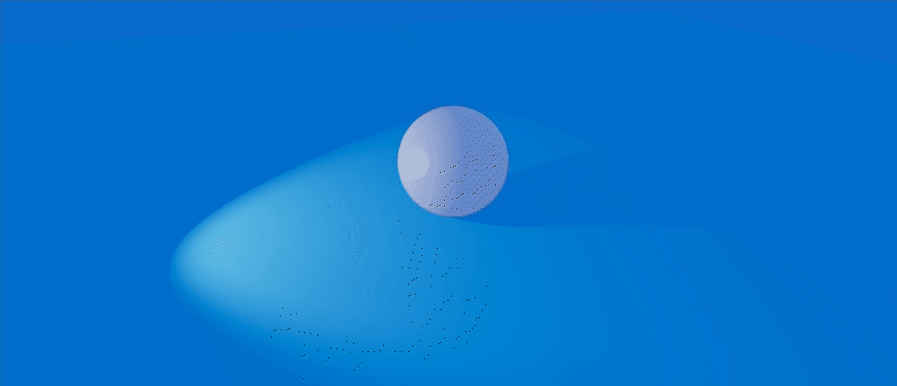

## Getting the position of the mouse
```js
  const orbitControlsRef = useRef(null);

  useFrame((state) => {
    if (!!orbitControlsRef.current) {
      const { x, y } = state.mouse;
      orbitControlsRef.current.setAzimuthalAngle(-x * angleToRadians(45));
      orbitControlsRef.current.setPolarAngle((y + 1) * angleToRadians(90 - 30));
      orbitControlsRef.current.update();
    }
  });
  useEffect(() => {}, [orbitControlsRef.current]);

<PerspectiveCamera makeDefault position={[0, 1, 5]} />
<OrbitControls ref={orbitControlsRef} />
<mesh >...</mesh>
```



## Lights and Shadows
```js
 <Canvas shadows>
  <mesh position={[0, 0.5, 0]} castShadow>
    <sphereGeometry args={[0.5, 32, 32]} />
    <meshStandardMaterial color="#ffffff" metalness={0.6} roughness={0.2} />
  </mesh>

  <mesh rotation={[-angleToRadians(90), 0, 0]} receiveShadow>
    <planeGeometry args={[20, 20]} />
    <meshStandardMaterial color="#1ea3d8" />
  </mesh>

  <ambientLight args={["#ffffff", 0.25]} />

  <spotLight
    args={["#ffffff", 1.5, 7, angleToRadians(45), 0.4]}
    position={[-3, 1, 0]}
    castShadow
  />
</Canvas>
```

## Enviroment
```js
<Environment background>
  <mesh>
      <sphereGeometry args={[50, 100, 100]} />
        <meshBasicMaterial side={THREE.BackSide} color="#2266cc" />
  </mesh>
</Environment>
```
